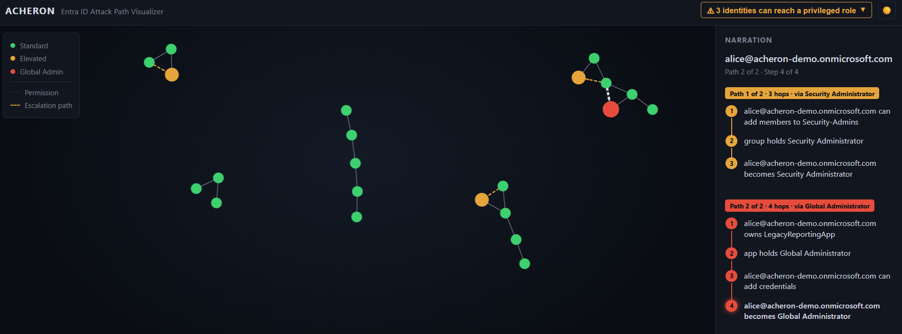
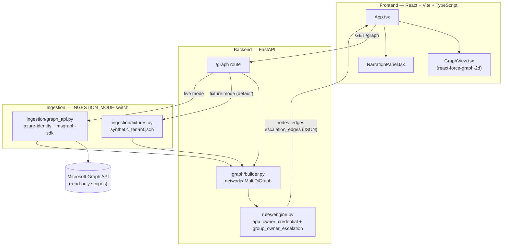

# Acheron

[](https://github.com/Josperdo/acheron/actions/workflows/ci.yml)
[](https://github.com/Josperdo/acheron/blob/main/LICENSE)
[](https://github.com/Josperdo/acheron/commits/main)

Acheron connects to an Azure/Entra ID tenant (read-only), builds an identity/permission graph, computes real privilege-escalation paths across it, and renders those paths as an interactive, animated graph in the browser. Think "mini BloodHound for Entra ID," scoped small and built clean.

Clone, `docker compose up`, and watch how privilege escalation actually chains together in Entra ID against the included synthetic dataset. Visualized, not just listed. Point it at a real (or sandboxed) tenant later by setting `INGESTION_MODE=live` and the app registration credentials in `.env`.



## Features

- Two real Entra ID escalation rules (app-owner credential, group-owner self-add) computed against an actual graph, not hardcoded
- Multiple paths per identity ranked shortest-first, with a click-to-trace hop-by-hop narration
- Blast-radius summary: how many identities can reach a privileged role, with a drill-down list
- Live Microsoft Graph ingestion (read-only) alongside a zero-credential synthetic fixture as the default
- Light/dark theme

## Architecture



## Setup

```
cp .env.example .env   # optional — defaults already run against the synthetic fixture
docker compose up
```

- Backend: http://localhost:8000 (`/health`, `/graph`)
- Frontend: http://localhost:5173

### Running without Docker

```
# backend
cd backend
pip install -r requirements.txt
uvicorn app.main:app --reload

# frontend
cd frontend
npm install
npm run dev
```

## Security considerations

- **Read-only, always.** The app registration only ever requests read-only Microsoft Graph scopes — `Directory.Read.All`, `RoleManagement.Read.Directory`, `Application.Read.All`, `Group.Read.All` — no write/modify Graph permissions are requested or used anywhere in the codebase.
- Ships with a synthetic dataset (`fixtures/synthetic_tenant.json`) so it runs with zero Azure credentials by default.
- `.env` (real credentials) is gitignored; only `.env.example` is committed.

## Known limitations (v1)

- Only 2 of the 4 planned escalation rules are scoped for v1 (app-owner credential escalation, group-owner self-add).
- Live Microsoft Graph ingestion (`backend/app/ingestion/graph_api.py`) covers what those 2 rules need: users, app ownership/credential capability, app service-principal role assignments, group ownership/membership capability, group role assignments. Broader ingestion (service principals as identities, direct user group membership and role assignments) isn't implemented yet.
- Single local session against one tenant at a time; no hosting/auth UI planned for v1.

## Lessons learned

- Canvas 2D can't read CSS custom properties — `ctx.fillStyle = "var(--x)"` silently fails. Colors used in `GraphView.tsx`'s canvas rendering are resolved via `getComputedStyle` up front instead.
- `react-force-graph-2d`'s underlying `accessor-fn` treats a plain string prop as "look up this field name on the data object," not "use this literal value." Passing `nodeCanvasObjectMode="before"` silently evaluated to `undefined` for every node and broke the pulse animation for two phases before being traced to the library's source.
- `docker compose build` failed with DNS errors reaching PyPI — root cause was NordVPN's DNS-leak protection refusing container traffic to Docker's default DNS servers, since it doesn't originate from the VPN-tunneled interface. Fixed by disabling the VPN for the build (not a project bug).
